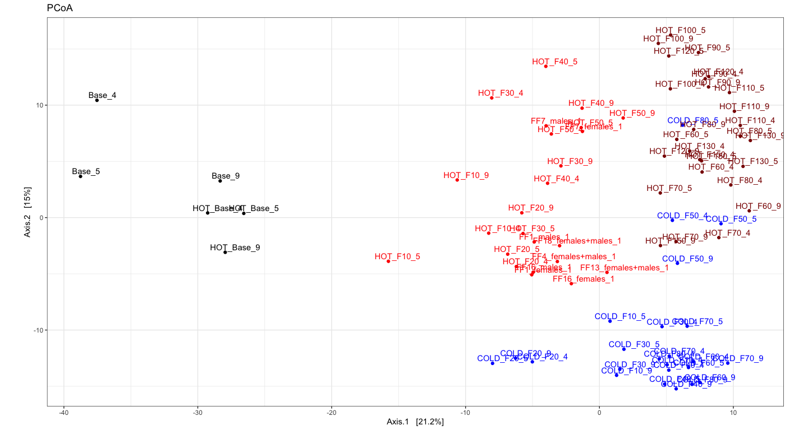
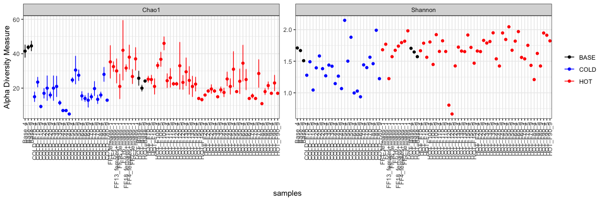
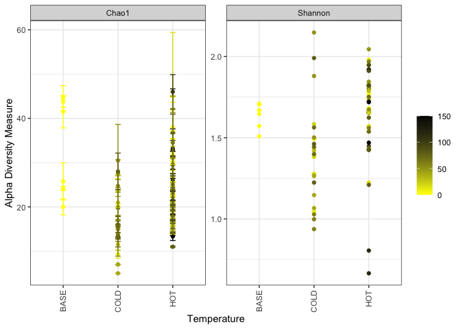

This script is based on
<a href="https://astrobiomike.github.io/amplicon/dada2_workflow_ex"
class="uri">AstroMkie amplicon sequencing tutorial</a>:

## Library loading

    library(tidyverse) ; packageVersion("tidyverse")

    ## [1] '1.3.2'

    library(phyloseq) ; packageVersion("phyloseq")

    ## [1] '1.40.0'

    library(vegan) ; packageVersion("vegan")

    ## [1] '2.6.2'

    library(DESeq2) ; packageVersion("DESeq2")

    ## [1] '1.36.0'

    library(dendextend) ; packageVersion("dendextend")

    ## [1] '1.16.0'

    library(viridis) ; packageVersion("viridis")

    ## [1] '0.6.2'

    library(areaplot)
    library(dplyr)

## (Re)-Reading in our data

We’re primarily going to work with our count table, our taxonomy table,
and a new table with some information about our samples:
sample\_info\_tab.

    count_tab <- read.table("03.DADA2/ASVs_counts.tsv", header=T, row.names=1,
                            check.names=F, sep="\t")

    tax_tab <- as.matrix(read.table("03.DADA2/ASVs_taxonomy.tsv", header=T,
                                    row.names=1, check.names=F, sep="\t"))

Only one ASV was assigned as *Wolbachia* (ASV\_1). However, this single
ASV accounts for 50-90% of the reads, depending on the sample. Since
*Wolbachia* does not belong to the microbiome, we are removing this ASV
from our tables and our analyses.

    count_woWol <- count_tab[-c(1), ]
    tax_woWol <- tax_tab[-c(1), ]

## Creating the sample information table

We are creating a metadata table with associated information about each
sample. We extract from the samples name the available information with
BASH and then we modify the table manually in order to add the info that
is not systematically included in the names (i.e. base population and
individual flies samples)

    RAW=~/PhD/Amplicon_sequencing/Old_16S/01.Raw_data
    RM=~/PhD/Amplicon_sequencing/Old_16S/02.Rm_adapters

    cd 04.Data_analysis
    echo -e Sample'\t'Temperature'\t'Generation'\t'Replicate > header.tmp
    cat $RM/fastq_wo_adapt/sample.list > names.tmp
    cat names.tmp | rev | cut -d "_" -f1 | rev > replicate.tmp
    cut -d "_" -f1  names.tmp > temperature.tmp
    cut -d "_" -f2  names.tmp > generation.tmp

    paste names.tmp temperature.tmp generation.tmp replicate.tmp > sample_info.tmp
    cat header.tmp sample_info.tmp > sample_info_auto.tsv
    rm *.tmp

    cd ..

    #sample_info_auto.tsv is modified manually, giving rise to sample_info.tsv

Sample\_info contains information about the temperature regime, the
generation of the flies and the replicate number of each sample. An
additional column, “Colour”, will be very useful for plotting.

    sample_info_tab <- read.table("04.Data_analysis/sample_info.tsv", header=T, row.names=1, check.names=F, sep="\t") 
    sample_info_tab$Colour <- as.character(sample_info_tab$Colour) 
    sample_info_tab[1:6,]

    ##            Temperature Generation Replicate Colour
    ## Base_4            BASE          0        14  black
    ## Base_5            BASE          0        15  black
    ## Base_9            BASE          0        19  black
    ## COLD_F10_4        COLD         10        14   blue
    ## COLD_F10_5        COLD         10        15   blue
    ## COLD_F10_9        COLD         10        19   blue

## Rarefaction curve

The rarefaction curve gives us an idea of the reads depth and richness
of each sequenced sample after removing ASV\_1 (*Wolbachia*). Both,
sequencing depth and expected number of ASVs per sample are very
heterogeneous. At first glance, hot-evolved microbiomes (light red and
dark red) and base microbiomes (black) seem to harbour more ASVs than
cold-evolved (blue).

    rarecurve(t(count_woWol), step=100, col=sample_info_tab$Colour, lwd=2, ylab="ASVs", label=F)
    abline(v=(min(rowSums(t(count_woWol)))))

## Beta diversity

### Sampling depth normalisation

We need to normalise for sampling depth because, as we have seen in the
rarefaction curve, it varies a lot between samples. Common ways to do
this involve either subsampling each sample down the the lowest sample’s
depth, or turning counts into proportions of the total for each sample.
According to statiticians, [it is better to normalise using **variance
stabilising transformation** because there is no loss of information as
in the case of
subsampling.](https://journals.plos.org/ploscompbiol/article?id=10.1371/journal.pcbi.1003531)
We do this with DESeq2.

    # first we need to make a DESeq2 object
    deseq_counts <- DESeqDataSetFromMatrix(count_woWol, colData = sample_info_tab, design = ~Temperature) 
    # we have to include the "colData" and "design" arguments because they are required, as they are needed for further downstream processing by DESeq2, but for our purposes of simply transforming the data right now, they don't matter

    deseq_counts_vst <- varianceStabilizingTransformation(deseq_counts)
    # and here is pulling out our transformed table
    vst_trans_count_tab <- assay(deseq_counts_vst)
    # and calculating our Euclidean distance matrix
    euc_dist <- dist(t(vst_trans_count_tab))

### Hierarchical clustering

Now that we have our Euclidean distance matrix, let’s make and plot a
hierarchical clustering of our samples.

    euc_clust <- hclust(euc_dist, method="ward.D2")
    # hclust objects like this can be plotted with the generic plot() function
    plot(euc_clust) 

        # but i like to change them to dendrograms for two reasons:
          # 1) it's easier to color the dendrogram plot by groups
          # 2) if wanted you can rotate clusters with the rotate() 
          #    function of the dendextend package

    euc_dend <- as.dendrogram(euc_clust, hang=0.1)
    dend_cols <- as.character(sample_info_tab$Colour[order.dendrogram(euc_dend)])
    labels_colors(euc_dend) <- dend_cols

    plot(euc_dend, ylab="VST Euc. dist.")

First, base populations split from adapted populations. This is due to
lab adaptation. At lower levels. samples cluster based on temperature
and generation and three clusters are formed: “early” hot adaptation
(generations 1-50, light red), “late” hot adaptation (generations
60-150, dark red) and cold adaptation (blue). However, the three cold
F50 populations and one cold F80 replicate cluster with the late
hot-evolved and the three cold F20 ones cluster with early hot-adapted.

<https://docs.google.com/spreadsheets/d/1odt_KDXPJzBP8GxGW-LZHdtbvY7MCgbjOcnwC-4fCm4/edit#gid=4>

<https://docs.google.com/spreadsheets/d/1odt_KDXPJzBP8GxGW-LZHdtbvY7MCgbjOcnwC-4fCm4/edit#gid=0>

### Ordination

Generally speaking, ordinations provide visualizations of
sample-relatedness based on dimension reduction. In our case, dimensions
are ASV counts per sample. Principle coordinates analysis (PCoA) is a
type of multidimensional scaling that operates on dissimilarities or
distances. We’re going to make a phyloseq object with our
*DESeq2*-transformed table and generate the PCoA from that.

    # making our phyloseq object with transformed table
    vst_count_phy <- otu_table(vst_trans_count_tab, taxa_are_rows=T)
    sample_info_tab_phy <- sample_data(sample_info_tab)
    vst_physeq <- phyloseq(vst_count_phy, sample_info_tab_phy)

    # generating and visualizing the PCoA with phyloseq
    vst_pcoa <- ordinate(vst_physeq, method="MDS", distance="euclidean")
    eigen_vals <- vst_pcoa$values$Eigenvalues # allows us to scale the axes according to their magnitude of separating apart the samples

    plot_ordination(vst_physeq, vst_pcoa, color="Colour") + 
      geom_point(size=1) + labs(col="Colour") + 
      geom_text(aes(label=rownames(sample_info_tab), hjust=0.3, vjust=-0.4)) + 
      coord_fixed(sqrt(eigen_vals[2]/eigen_vals[1])) + ggtitle("PCoA") + 
      scale_color_manual(values=unique(sample_info_tab$Colour[order(sample_info_tab$Colour)])) + 
      theme_bw() + theme(legend.position="none")

This is just providing us with a different overview of how our samples
relate to each other. Inferences that are consistent with the
hierarchical clustering above can be considered a bit more robust if the
same general trends emerge from both approaches. It’s important to
remember that these are **exploratory visualizations** and do not say
anything statistically about our samples.

But our initial exploration here shows us that the main source of
variance between the microbiomes is due to lab adaptation, separating
base populations, hot early and hot late populations. But the second
axis could be temperature, since it separates hot from cold populations.

## Alpha diversity

#### Richness and diversity estimates

Here we’re going to plot Chao1 richness esimates and Shannon diversity
values. Chao1 is a richness estimator, “richness” being the total number
of distinct units in our sample, “distinct units” being whatever we
happen to be measuring (ASVs in our case here). And Shannon’s diversity
index is a metric of diversity. The term diversity includes “richness”
(the total number of our distinct units) and “evenness” (the relative
proportions of all of our distinct units). **Again, these are really
just metrics to help contrast our samples within an experiment, and
should not be considered “true” values of anything or be compared across
studies.**

    # first we need to create a phyloseq object using our un-transformed count table
    count_tab_phy <- otu_table(count_woWol, taxa_are_rows=T)
    tax_tab_phy <- tax_table(tax_woWol)

    ASV_physeq <- phyloseq(count_tab_phy, tax_tab_phy, sample_info_tab_phy)

    # and now we can call the plot_richness() function on our phyloseq object
    plot_richness(ASV_physeq, color="Temperature", measures=c("Chao1", "Shannon")) + 
      scale_color_manual(values=unique(sample_info_tab$Colour[order(sample_info_tab$Temperature)])) +
      theme_bw() + theme(legend.title = element_blank(), axis.text.x = element_text(angle = 90, vjust = 0.5, hjust = 1))

    plot_richness(ASV_physeq, x="Temperature", color="Generation", measures=c("Chao1", "Shannon")) + 
      scale_color_gradient(low="yellow", high="black") +
      theme_bw() + 
      theme(legend.title = element_blank(), axis.text.x = element_text(angle = 90, vjust = 0.5, hjust = 1))

I HAVEN’T ANALYSED THIS YET BECAUSE I AM NOT INTERESTED

## Taxonomic summary

Here we’ll make some broad-level summarisation figures. Phyloseq is also
very useful for parsing things down by taxonomy now that we’ve got all
that information in there.

    # using phyloseq to make a count table that has summed all ASVs that were in the same order
    order_counts_tab <- otu_table(tax_glom(ASV_physeq, taxrank="order"))

    # making a vector of order names to set as row names
    order_tax_vec <- as.vector(tax_table(tax_glom(ASV_physeq, taxrank="order"))[,"order"])
    rownames(order_counts_tab) <- as.vector(order_tax_vec)

    # we also have to account for sequences that weren't assigned any taxonomy even at the order level these came into R as 'NAs' in the taxonomy table, but their counts are still in the count table so we can get that value for each sample by subtracting the column sums of this new table (that has everything that had a order assigned to it) from the column sums of the starting count table (that has all representative sequences)
    unclassified_tax_counts <- colSums(count_woWol) - colSums(order_counts_tab)
    # and we'll add this row to our order count table:
    order_and_unidentified_counts_tab <- rbind(order_counts_tab, "Unclassified"=unclassified_tax_counts)

    # now we'll remove the Acetobacterales, so we can next add them back in broken down by ASV
    temp_major_taxa_counts_tab <- order_and_unidentified_counts_tab[!row.names(order_and_unidentified_counts_tab) %in% "Acetobacterales", ]

    # making count table broken down by ASV (contains ASVs beyond the Acetobacterales too at this point)
    ASV_counts_tab <- otu_table(tax_glom(ASV_physeq, taxrank="ASV")) 

    # making a table that holds the order and ASV level info
    ASV_tax_phy_tab <- tax_table(tax_glom(ASV_physeq, taxrank="ASV")) 

    or_tmp_vec <- ASV_tax_phy_tab[,4]
    ASV_tmp_vec <- ASV_tax_phy_tab[,8]
    rows_tmp <- row.names(ASV_tax_phy_tab)
    ASV_tax_tab <- data.frame("order"=or_tmp_vec, "ASV"=ASV_tmp_vec, row.names = rows_tmp)

    # making a vector of just the Acetobacterales order
    Aceto_ASVs_vec <- as.vector(ASV_tax_tab[ASV_tax_tab$order == "Acetobacterales", "ASV"])

    # making a table of the counts of the Acetobacterales ASVs
    Aceto_ASVs_counts_tab <- ASV_counts_tab[row.names(ASV_counts_tab) %in% Aceto_ASVs_vec, ]

    # now combining the tables:
    major_taxa_counts_tab <- rbind(temp_major_taxa_counts_tab, Aceto_ASVs_counts_tab)

    # and to check we didn't miss any other sequences, we can compare the column sums to see if they are the same if "TRUE", we know nothing fell through the cracks
    identical(colSums(major_taxa_counts_tab), colSums(count_woWol)) 

    ## [1] TRUE

    # now we'll generate a proportions table for summarizing:
    major_taxa_proportions_tab <- apply(major_taxa_counts_tab, 2, function(x) x/sum(x)*100)
    major_taxa_proportions_tab <- data.frame(major_taxa_proportions_tab)
    # if we check the dimensions of this table at this point
    dim(major_taxa_proportions_tab)

    ## [1] 33 81

    # we see there are currently 33 rows. Many of these taxa make up a very small percentage, so we're can filter some out. This is a completely arbitrary decision solely to ease visualization and interpretation.

    # we remove from our taxa proportion those taxa that appear in a proportion lower than 5% in the samples, as well as the "Unclassified" taxon
    temp_filt_major_taxa_proportions_tab <- data.frame(major_taxa_proportions_tab[apply(major_taxa_proportions_tab, 1, max) > 5, ]) 

    temp_filt_major_taxa_proportions_tab <- temp_filt_major_taxa_proportions_tab[!row.names(temp_filt_major_taxa_proportions_tab) %in% "Unclassified", ]
      
    # checking how many we have that were above this threshold
    dim(temp_filt_major_taxa_proportions_tab) 

    ## [1] 11 81

    # now we have 11, much more manageable for an overview figure

    # though each of the filtered taxa made up less than 5% alone, together they may add up and should still be included in the overall summary so we're going to add a row called "Other" that keeps track of how much we filtered out (which will also keep our totals at 100%)
    filtered_proportions <- colSums(major_taxa_proportions_tab) - colSums(temp_filt_major_taxa_proportions_tab)

    filt_major_taxa_proportions_tab <- rbind(temp_filt_major_taxa_proportions_tab, "Other"=filtered_proportions)

    ## don't worry if the numbers or taxonomy vary a little, this might happen due to different versions being used from when this was initially put together

Now that we have a nice proportions table ready to go, we can make some
figures with it. While not always all that informative, we’ll make some
stacked bar charts. We’ll use ggplot2 to do this, and for these types of
plots it seems to be easiest to work with tables in [narrow
format](https://en.wikipedia.org/wiki/Wide_and_narrow_data#Narrow).
We’ll see what that means, how to transform the table, and then add some
information for the samples to help with plotting.

    # first let's make a copy of our table that's safe for manipulating
    major_taxa_proportions_tab_for_plot <- filt_major_taxa_proportions_tab

    # and add a column of the taxa names so that it is within the table, rather than just as row names (this makes working with ggplot easier)
    major_taxa_proportions_tab_for_plot$Major_Taxa <- row.names(major_taxa_proportions_tab_for_plot)

    # now we'll transform the table into narrow, or long, format (also makes plotting easier)
    major_taxa_proportions_tab_for_plot.g <- pivot_longer(major_taxa_proportions_tab_for_plot, !Major_Taxa, names_to = "Sample", values_to = "Proportion") %>% data.frame()

    # take a look at the new table and compare it with the old one
    head(major_taxa_proportions_tab_for_plot.g)

    ##         Major_Taxa     Sample Proportion
    ## 1 Enterobacterales     Base_4 14.0321879
    ## 2 Enterobacterales     Base_5  5.0874501
    ## 3 Enterobacterales     Base_9  0.3053285
    ## 4 Enterobacterales COLD_F10_4  0.0000000
    ## 5 Enterobacterales COLD_F10_5  0.0000000
    ## 6 Enterobacterales COLD_F10_9  0.0000000

    head(major_taxa_proportions_tab_for_plot)

    ##                        Base_4      Base_5       Base_9 COLD_F10_4 COLD_F10_5
    ## Enterobacterales  14.03218791  5.08745014  0.305328474  0.0000000 0.00000000
    ## Chitinophagales   29.60417573 32.42098803 33.694474540  0.0000000 0.15801354
    ## Orbales            0.00000000  0.00000000  0.004924653  0.0000000 0.02257336
    ## Lactobacillales    5.28055676  6.20435716  8.174923668  0.8484163 9.18735892
    ## Corynebacteriales  0.02609830  0.00000000  0.009849306  0.2262443 0.00000000
    ## Chloroplast        0.03479774  0.06136852  0.000000000  0.0000000 0.00000000
    ##                   COLD_F10_9 COLD_F20_4 COLD_F20_5 COLD_F20_9 COLD_F30_4
    ## Enterobacterales   0.0000000  0.0000000   0.000000   0.000000  0.0000000
    ## Chitinophagales    0.1792115  2.2837370   2.329916   1.980924  0.0000000
    ## Orbales            0.0000000  0.0000000   0.000000   0.000000  0.2396932
    ## Lactobacillales    0.4480287  1.1072664   1.677540   2.421130 12.7996165
    ## Corynebacteriales  0.0000000  0.0000000   0.000000   0.000000  0.0000000
    ## Chloroplast        0.0000000  0.7612457   0.000000   0.000000  0.0000000
    ##                    COLD_F30_5 COLD_F30_9 COLD_F40_4 COLD_F40_5 COLD_F40_9
    ## Enterobacterales   0.00000000    0.00000   0.000000   0.000000   0.000000
    ## Chitinophagales    0.03692762    0.00000   0.000000   0.000000   0.000000
    ## Orbales            0.00000000    0.00000   0.000000   0.000000   0.000000
    ## Lactobacillales   20.49483013   11.28261   1.933301   1.369863   1.965924
    ## Corynebacteriales  0.00000000    0.00000   0.000000   0.000000   0.000000
    ## Chloroplast        0.00000000    0.00000   0.000000   0.000000   0.000000
    ##                   COLD_F50_4 COLD_F50_5 COLD_F50_9 COLD_F60_4 COLD_F60_5
    ## Enterobacterales     0.00000  0.0000000   0.000000  0.0000000    0.00000
    ## Chitinophagales      0.00000  0.8462623   0.617284  0.1742919    0.00000
    ## Orbales              0.00000  0.3526093   0.000000  0.1307190    0.00000
    ## Lactobacillales     12.43028  7.2637518   8.436214  1.6122004    3.03757
    ## Corynebacteriales   17.84861  6.6290550   8.230453  0.0000000    0.00000
    ## Chloroplast          0.00000  0.0000000   0.000000  0.0000000    0.00000
    ##                   COLD_F60_9 COLD_F70_4 COLD_F70_5 COLD_F70_9 COLD_F80_4
    ## Enterobacterales    0.000000  0.0000000   0.154321 27.8982092 38.0057286
    ## Chitinophagales     0.000000  0.3298516   0.000000  0.0000000  0.0179019
    ## Orbales             0.000000  0.0000000   0.000000  0.0000000  0.0000000
    ## Lactobacillales     1.849218  5.2776251   1.851852  0.6597549  2.0229144
    ## Corynebacteriales   0.000000  0.0000000   2.006173  0.0000000  0.0358038
    ## Chloroplast         0.000000  0.0000000   0.000000  0.0000000  0.0000000
    ##                   COLD_F80_5 COLD_F80_9 FF13_females.males_1 FF16_females_1
    ## Enterobacterales  32.7221877  51.742044            3.2647585       8.024691
    ## Chitinophagales    0.2486016   0.000000            0.2236136       0.308642
    ## Orbales            5.1895587   0.000000            0.0000000       0.000000
    ## Lactobacillales    1.5226849   1.122278            1.1627907       1.748971
    ## Corynebacteriales  0.9011809   0.000000            0.0000000       0.000000
    ## Chloroplast        0.0000000   0.000000            0.0000000       0.000000
    ##                   FF16_males_1 FF18_females.males_1 FF1_females_1 FF1_males_1
    ## Enterobacterales     17.323556            2.8595110    16.9074700 10.20820699
    ## Chitinophagales       1.008249            0.1657688     0.1844451  0.50535678
    ## Orbales               0.000000            0.0000000     0.0000000  0.00000000
    ## Lactobacillales       1.741522            8.4127642     1.7829696  3.53749747
    ## Corynebacteriales     0.000000            0.0000000     0.0000000  0.06064281
    ## Chloroplast           0.000000            0.0000000     0.0000000  0.00000000
    ##                   FF4_females.males_1 FF7_females_1 FF7_males_1  HOT_Base_4
    ## Enterobacterales           19.6116039   31.01131542  22.2754874 13.75166889
    ## Chitinophagales             0.3836011    0.07072136   0.3835091 33.96528705
    ## Orbales                     0.0000000    0.00000000   0.0000000  0.00000000
    ## Lactobacillales             1.7981299    9.15841584  16.0434644  7.66355140
    ## Corynebacteriales           0.0719252    2.22772277   2.5886865  0.00000000
    ## Chloroplast                 0.3836011    0.00000000   0.0000000  0.05340454
    ##                   HOT_Base_5 HOT_Base_9   HOT_F100_4  HOT_F100_5  HOT_F100_9
    ## Enterobacterales    6.184118  0.3354839 30.219135658 57.93261626 32.32273437
    ## Chitinophagales    37.807449 41.3677419  0.009384825  0.03559000  0.02875688
    ## Orbales             0.000000  0.0000000  0.089155835  0.18585891  5.92802563
    ## Lactobacillales     7.917545 11.0451613  5.171038431  4.26289149  4.31353217
    ## Corynebacteriales   0.000000  0.0000000  4.302942143  1.96535906  3.20023006
    ## Chloroplast         0.000000  0.0000000  0.018769649  0.00790889  0.00000000
    ##                    HOT_F10_4 HOT_F10_5  HOT_F10_9 HOT_F110_4  HOT_F110_5
    ## Enterobacterales   0.9808102  7.301468  7.5216565  52.532601 11.59250585
    ## Chitinophagales   17.1641791 16.258939 11.7261779   0.000000  0.05018401
    ## Orbales            0.0000000  0.000000  0.0000000  10.061771 27.33355637
    ## Lactobacillales    3.6673774  2.333459  3.2748785   3.596431  5.82134493
    ## Corynebacteriales  0.5117271  0.000000  0.4648215   1.249142  4.70056875
    ## Chloroplast        0.0000000  0.000000  0.0000000   0.000000  0.00000000
    ##                    HOT_F110_9  HOT_F120_4 HOT_F120_5  HOT_F120_9  HOT_F130_4
    ## Enterobacterales  12.22780570 82.64625049  85.795645 54.10189983 25.10094213
    ## Chitinophagales    0.04187605  0.07852375   0.000000  0.04317789  0.03364738
    ## Orbales           48.84840871  0.07852375   0.000000  0.00000000  0.13458950
    ## Lactobacillales    2.28224456  1.21711818   2.110553  1.89982729  2.59084791
    ## Corynebacteriales  1.48659966  5.02552022   4.288107  5.91537133  1.44683715
    ## Chloroplast        0.00000000  0.00000000   0.000000  0.00000000  0.00000000
    ##                    HOT_F130_5  HOT_F130_9 HOT_F150_4 HOT_F150_5  HOT_F150_9
    ## Enterobacterales  30.72340426 37.94485034  10.550162 32.7499159 23.39428036
    ## Chitinophagales    0.00000000  0.02356823   0.000000  0.0000000  0.04688233
    ## Orbales            0.29787234  3.22884751   6.148867  0.3029283  0.00000000
    ## Lactobacillales    1.31914894  2.07400424   2.006472  2.5580613  1.07829348
    ## Corynebacteriales  2.21276596  1.55550318   3.042071  1.1443958  0.14064698
    ## Chloroplast        0.08510638  0.00000000   0.000000  0.0000000  0.00000000
    ##                    HOT_F20_4  HOT_F20_5  HOT_F20_9  HOT_F30_4 HOT_F30_5
    ## Enterobacterales   0.9828789  3.2841948  4.1406158 35.2371733  1.484480
    ## Chitinophagales   28.2181357 20.8807613 19.1813141  1.7424976  2.834008
    ## Orbales            0.6024096  0.4478447  0.0000000  0.1936108  0.000000
    ## Lactobacillales    1.3633481  1.1569323  2.8075970  2.0329138  2.361673
    ## Corynebacteriales  0.0000000  0.0000000  0.6606111  4.1626331  2.496626
    ## Chloroplast        0.0000000  0.0000000  0.0000000  0.0000000  0.000000
    ##                    HOT_F30_9  HOT_F40_4 HOT_F40_5  HOT_F40_9  HOT_F50_4
    ## Enterobacterales  17.7910194 13.7577002  5.130041 20.7931179  7.4503311
    ## Chitinophagales    1.4045542 53.2169747 63.230733 12.7360470  0.3863135
    ## Orbales            7.5547989  0.0000000  3.889287  0.7763324  2.8421634
    ## Lactobacillales    0.9363694  0.9924709  1.503221  3.5459505 10.1545254
    ## Corynebacteriales  1.1917429  5.2019165  4.963016  6.0637851  1.1037528
    ## Chloroplast        0.0000000  0.0000000  0.000000  0.0000000  0.0000000
    ##                    HOT_F50_5  HOT_F50_9   HOT_F60_4   HOT_F60_5  HOT_F60_9
    ## Enterobacterales  15.3185397 19.5398574  0.01945147  1.37931034  0.0000000
    ## Chitinophagales    0.3937008  0.1296176  0.00000000  0.03134796  0.0000000
    ## Orbales            2.0400859  2.1386909  1.57556896  1.59874608  0.5277045
    ## Lactobacillales   31.1023622  3.9533377 52.79128574 44.48275862  2.9463500
    ## Corynebacteriales  1.7895490  1.5230071  6.92472282  6.52037618 15.0395778
    ## Chloroplast        0.0000000  0.0000000  0.00000000  0.00000000  0.0000000
    ##                   HOT_F70_4 HOT_F70_5  HOT_F70_9  HOT_F80_4  HOT_F80_5
    ## Enterobacterales  0.0000000  5.972696 0.00000000 61.1178615 50.9125841
    ## Chitinophagales   0.0739645  0.000000 0.07304602  0.2430134  0.5763689
    ## Orbales           2.1449704  1.109215 0.36523009  1.2150668  2.4015370
    ## Lactobacillales   2.1449704  3.242321 1.89919649  0.9720535  1.4409222
    ## Corynebacteriales 1.9230769  1.194539 2.26442659  2.7946537  4.5148895
    ## Chloroplast       0.0000000  0.000000 0.00000000  0.0000000  9.4140250
    ##                    HOT_F80_9  HOT_F90_4   HOT_F90_5 HOT_F90_9        Major_Taxa
    ## Enterobacterales  56.8523790 24.8776509 15.68746214 16.233391  Enterobacterales
    ## Chitinophagales    0.1220008  0.4078303  0.30284676  0.000000   Chitinophagales
    ## Orbales            2.1553477 13.5399674 30.28467595 42.807626           Orbales
    ## Lactobacillales    1.7080114  3.7520392  5.20896426  5.430387   Lactobacillales
    ## Corynebacteriales  2.5213501  2.3654160  2.78619019  1.559792 Corynebacteriales
    ## Chloroplast        0.0000000  0.0000000  0.06056935  0.000000       Chloroplast

    # manipulating tables like this is something you may need to do frequently in R

    # now we want a table with "colour" and "characteristics" of each sample to function. Here we're making a new table by pulling what we want from the sample information table
    sample_info_for_merge<-data.frame("Sample"=row.names(sample_info_tab), "Temperature"=sample_info_tab$Temperature, "Replicate"=sample_info_tab$Replicate, "Generation"=sample_info_tab$Generation, "Colour"=sample_info_tab$Colour, stringsAsFactors=F)

    # and here we are merging this table with the plotting table we just made
    # (this is an awesome function!)
    major_taxa_proportions_tab_for_plot.g2 <- merge(major_taxa_proportions_tab_for_plot.g, sample_info_for_merge)

    # we change the order of the taxa, so ASVs are at the bottom and we can see their variation more easily
    major_taxa_proportions_tab_for_plot.g2$Major_Taxa <- factor(major_taxa_proportions_tab_for_plot.g2$Major_Taxa, sort(unique(major_taxa_proportions_tab_for_plot.g2$Major_Taxa), decreasing = TRUE))

    # and now we're ready to make some summary figures with our wonderfully constructed table

    # a good color scheme can be hard to find, I included the viridis package here because it's color-blind friendly and sometimes it's been really helpful for me, though this is not demonstrated in all of the following :/ 

    # one common way to look at this is with stacked bar charts for each taxon per sample:
    ggplot(major_taxa_proportions_tab_for_plot.g2, aes(x=Sample, y=Proportion, fill=Major_Taxa)) +
        geom_bar(width=0.6, stat="identity") +
        theme_bw() +
        theme(axis.text.x=element_text(angle=90, vjust=0.4, hjust=1), legend.title=element_blank()) +
        labs(x="Sample", y="% of 16S rRNA gene copies recovered", title="All samples")

    # However, this is super messy. We need to plot by temperature and replicate if we want to extract any conclusion from this time-series data
    Replicate_4.g2 <- subset(major_taxa_proportions_tab_for_plot.g2, major_taxa_proportions_tab_for_plot.g2$Replicate == "4")

    ggplot(Replicate_4.g2, aes(x=Generation, y=Proportion, fill=Major_Taxa)) +
        geom_area(alpha=0.6, size=0.5, colour="black") +
        theme_bw() +
        expand_limits(y=c(0,100)) +
        theme(axis.text.x=element_text(angle=90, vjust=0.4, hjust=1), legend.title=element_blank()) +
        labs(x="Generation", y="% of 16S rRNA gene copies recovered", title="Replicate 4")

    Replicate_5.g2 <- subset(major_taxa_proportions_tab_for_plot.g2, major_taxa_proportions_tab_for_plot.g2$Replicate == "5")

    ggplot(Replicate_5.g2, aes(x=Generation, y=Proportion, fill=Major_Taxa)) +
        geom_area(alpha=0.6, size=0.5, colour="black") +
        theme_bw() +
        expand_limits(y=c(0,100)) +
        theme(axis.text.x=element_text(angle=90, vjust=0.4, hjust=1), legend.title=element_blank()) +
        labs(x="Generation", y="% of 16S rRNA gene copies recovered", title="Replicate 5")

    Replicate_9.g2 <- subset(major_taxa_proportions_tab_for_plot.g2, major_taxa_proportions_tab_for_plot.g2$Replicate == "9")

    ggplot(Replicate_9.g2, aes(x=Generation, y=Proportion, fill=Major_Taxa)) +
        geom_area(alpha=0.6, size=0.5, colour="black") +
        theme_bw() +
        expand_limits(y=c(0,100)) +
        theme(axis.text.x=element_text(angle=90, vjust=0.4, hjust=1), legend.title=element_blank()) +
        labs(x="Generation", y="% of 16S rRNA gene copies recovered", title="Replicate 9")

    Replicate_14.g2 <- subset(major_taxa_proportions_tab_for_plot.g2, major_taxa_proportions_tab_for_plot.g2$Replicate == "14")

    ggplot(Replicate_14.g2, aes(x=Generation, y=Proportion, fill=Major_Taxa)) +
        geom_area(alpha=0.6, size=0.5, colour="black") +
        theme_bw() +
        expand_limits(y=c(0,100)) +
        theme(axis.text.x=element_text(angle=90, vjust=0.4, hjust=1), legend.title=element_blank()) +
        labs(x="Generation", y="% of 16S rRNA gene copies recovered", title="Replicate 14")

    Replicate_15.g2 <- subset(major_taxa_proportions_tab_for_plot.g2, major_taxa_proportions_tab_for_plot.g2$Replicate == "15")

    ggplot(Replicate_15.g2, aes(x=Generation, y=Proportion, fill=Major_Taxa)) +
        geom_area(alpha=0.6, size=0.5, colour="black") +
        theme_bw() +
        expand_limits(y=c(0,100)) +
        theme(axis.text.x=element_text(angle=90, vjust=0.4, hjust=1), legend.title=element_blank()) +
        labs(x="Generation", y="% of 16S rRNA gene copies recovered", title="Replicate 15")

    Replicate_19.g2 <- subset(major_taxa_proportions_tab_for_plot.g2, major_taxa_proportions_tab_for_plot.g2$Replicate == "19")

    ggplot(Replicate_19.g2, aes(x=Generation, y=Proportion, fill=Major_Taxa)) +
        geom_area(alpha=0.6, size=0.5, colour="black") +
        theme_bw() +
        expand_limits(y=c(0,100)) +
        theme(axis.text.x=element_text(angle=90, vjust=0.4, hjust=1), legend.title=element_blank()) +
        labs(x="Generation", y="% of 16S rRNA gene copies recovered", title="Replicate 19")

## Associating ASVs to isolate genomes from the *Drosophila* microbiome

In order to associate the *Acetobacter* ASVs to the 16S rRNA genes
extracted from our whole genomes, I am making a custom database with the
whole genome 16S rRNAs from the species *Acetobacter indonesiensis, A.
malorum, A. oryzifermentans* and *A. sicerae.*

    #With this lines I retrieve all the Drosophila-associated whole genomes that we have, I extract the 16S rRNA sequences that belong to Acetobacter species and I delete them again because I don't want the rest of the genomes.

    mkdir tmp && cd tmp

    cp ~/PhD/Isolates_assembly/Pool_5??/07.GTDB-Tk/Genomes/*.fa .
    cat ~/PhD/Isolates_assembly/Pool_5??/07.GTDB-Tk/summary.tsv > ../05.BLAST/Taxons.tsv

    for i in $(awk -F'\t' '($2 ~ "Acetobacter ") {print $1}' ../05.BLAST/Taxons.tsv)
    do  barrnap --kingdom bac --threads 8 --outseq ${i}.tmp ${i}.fa;
        grep -A1 ">16S_" ${i}.tmp | sed -E 's/::.*/_'${i}'/g' | sed -E 's/.fa//' >> 16S_Aceto.tmp
    done

    #Some genomes have more than 1 16S sequence, so I rename these with seqkit
    sed '/--/d' 16S_Aceto.tmp | seqkit rename -w 0 > ../05.BLAST/database/16S_database.fasta

    cd .. && rm -r tmp

Then I blast the ASVs against the 16S rRNA *Acetobacter* custom
database.

    cd 05.BLAST

    # Now we make a custom database with the files that we have retrieved
    makeblastdb -in database/16S_database.fasta -parse_seqids -dbtype nucl

    # And we run blast using as query the ASVs multifasta.
    blastn -db database/16S_database.fasta -query ../03.DADA2/ASVs.fa -out output/ASV_taxonomy.tmp -outfmt 6

    echo -e qseqid'\t'sseqid'\t'pident'\t'length'\t'mismatch'\t'gapopen'\t'qstart'\t'qend'\t'sstart'\t'send'\t'evalue'\t'bitscore > output/header.tmp

    cat output/header.tmp output/ASV_taxonomy.tmp > output/ASV_taxonomy.tsv

    rm output/*tmp

Here I associate the genome ID to its taxonomy in the BLAST matches
table.

    # I read the BLAST output, use sub() to remove "16S_rRNA_" from each row and transform it again into a dataframe.
    BLAST <- read.table(file="05.BLAST/output/ASV_taxonomy.tsv", header=TRUE)
    BLAST <- lapply(BLAST, function(x) sub("16S_rRNA_", "", x, fixed = TRUE))
    BLAST <- as.data.frame(BLAST)

    # I read the taxonomy of the 16S rRNA sequences, use sub() to leave only genus and species and transform it again into a dataframe.
    BLAST2 <- read.table(file="05.BLAST/Taxons.tsv", header=TRUE, sep="\t", na.strings="NA")
    BLAST2 <- lapply(BLAST2, function(x) sub("d__Bacteria;p__Proteobacteria;c__Alphaproteobacteria;o__Acetobacterales;f__Acetobacteraceae;g__Acetobacter;s__", "", x, fixed = TRUE))
    BLAST2 <- as.data.frame(BLAST2)

    # I use left_join() to add a column with genus and species to each row of the BLAST result. I use left_join() instead of merge() because the former keeps the rows as they were in the original file.
    BLAST3 <- left_join(BLAST, BLAST2[,1:2], by = c("sseqid" = "user_genome"))

    head(BLAST3)

    ##   qseqid        sseqid pident length mismatch gapopen qstart qend sstart send
    ## 1  ASV_2       591a_11    100     95        0       0      1   95    324  418
    ## 2  ASV_2       591a_11 98.889     90        1       0    106  195    636  725
    ## 3  ASV_2 591a_15_bin_2    100     95        0       0      1   95    324  418
    ## 4  ASV_2 591a_15_bin_2 98.889     90        1       0    106  195    636  725
    ## 5  ASV_2 591a_17_bin_1    100     95        0       0      1   95    324  418
    ## 6  ASV_2 591a_17_bin_1 98.889     90        1       0    106  195    636  725
    ##     evalue bitscore            classification
    ## 1 7.78e-47      176       Acetobacter malorum
    ## 2 2.18e-42      161       Acetobacter malorum
    ## 3 7.78e-47      176 Acetobacter indonesiensis
    ## 4 2.18e-42      161 Acetobacter indonesiensis
    ## 5 7.78e-47      176       Acetobacter malorum
    ## 6 2.18e-42      161       Acetobacter malorum

    write.table(BLAST3, "05.BLAST/output/Results+taxonomy.tsv", sep = "\t", quote=F, col.names=NA)
